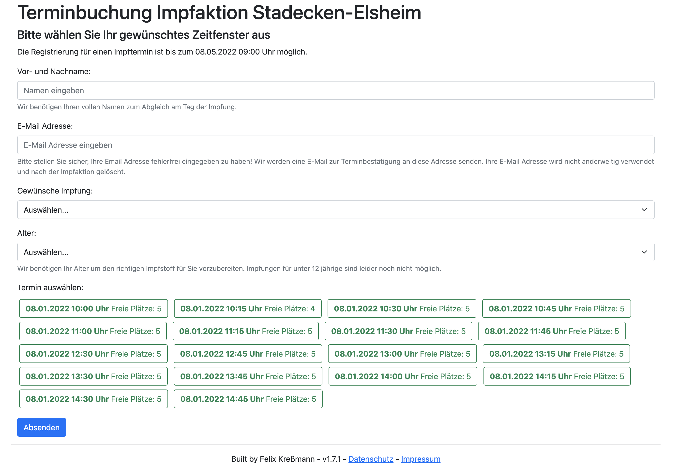

# Impftermin
This tool was built to support my villages' vaccination campaigns with managing appointments.

It's a small Python Flask app using server side rendering with Jinja2.

In the DB, you just provide a list of possible timeslots and their capacity (one timeslot can be booked multiple times).

## User Features
- See on the main page which timeslot have what capacity left
- 'Request' a timeslot having free capacity providing name, email and some details
- Confirm booking 'request' with clicking on a link in the email sent by the system
- Use the link in the email to manage (cancel) you appointment later

## Admin features
- Get an overview of how much capacity is still left
- See who reserved/booked when
- Manually add bookings (not taking the left capacity into account)
- Delete bookings
- Print a list of bookings

## Screenshots

